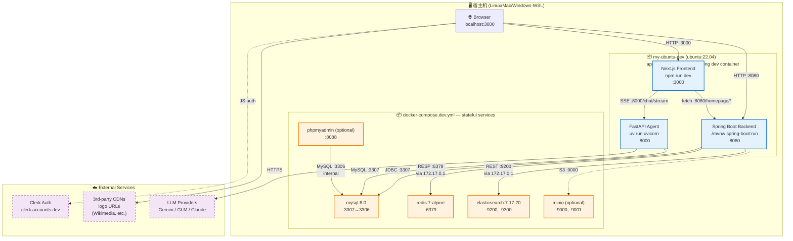
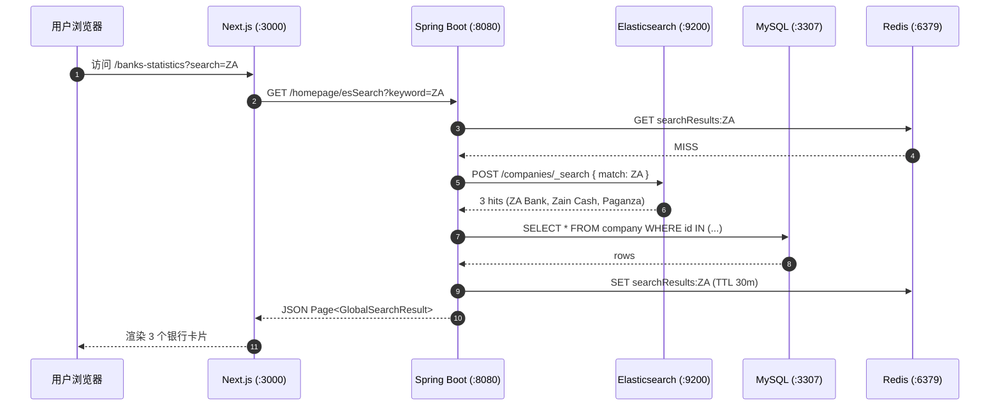

# Neobanker DEV 环境架构

> 关于一键启动：`bash dev/bootstrap.sh`，详见同目录 `bootstrap.sh` 头注释

---

## 1. 总览（容器拓扑）



---

## 2. 端口与对应关系

| 端口 | 服务 | 容器 | 协议 | 谁连它 |
|---:|---|---|---|---|
| **3000** | Next.js Frontend | `my-ubuntu-dev` | HTTP | 浏览器 |
| **8080** | Spring Boot Backend | `my-ubuntu-dev` | HTTP/REST | Frontend, 浏览器 |
| **8000** | FastAPI Agent | `my-ubuntu-dev` | HTTP/SSE | Frontend (chat panel) |
| **3307** | MySQL 8.0 | `neobanker-mysql` | MySQL wire | Backend, Agent, 导入脚本 |
| **9200** | Elasticsearch 7.17 | `neobanker-elasticsearch` | HTTP/REST | Backend |
| **9300** | Elasticsearch transport | `neobanker-elasticsearch` | binary | (内部 / 集群通讯) |
| **6379** | Redis 7 | `neobanker-redis` | RESP | Backend (缓存) |
| **9000** | MinIO S3 (可选) | `neobanker-minio` | S3 API | Backend (文件上传) |
| **9001** | MinIO Console (可选) | `neobanker-minio` | HTTP | 浏览器 |
| **8088** | phpMyAdmin (可选) | `neobanker-phpmyadmin` | HTTP | 浏览器 |

---

## 3. 容器互访（这是个坑！）

**问题**：`my-ubuntu-dev` 容器内的 backend 怎么连 `neobanker-mysql` 容器？

**3 种容器互访方式**：

| 方式 | 适用场景 | hostname | 备注 |
|---|---|---|---|
| 同 docker network | 两个容器在同一 user-defined network | service name (e.g. `mysql`) | 推荐生产；要求 `--network` 一致 |
| Docker bridge gateway | 容器跨 network 但都在 docker0 桥 | `172.17.0.1` (Linux) | dev 当前用的方式 |
| host network | Mac/Windows | `host.docker.internal` | Docker Desktop 提供 |

**当前 dev 实际**：
- `my-ubuntu-dev` 用默认 bridge → 看到 docker0 gateway = `172.17.0.1`
- `neobanker-mysql` 在 `neobanker_neobanker` 网络 → 也通过 `172.17.0.1` 暴露 host port 3307
- backend 连 `172.17.0.1:3307`（host port），不是 mysql 容器的 3306

**bootstrap.sh 用环境变量自动切换**：
```bash
ELASTICSEARCH_HOST=172.17.0.1
SPRING_DATA_REDIS_HOST=172.17.0.1
SPRING_DATA_REDIS_PORT=6379
SPRING_ELASTICSEARCH_REST_URIS=172.17.0.1:9200
```
（覆盖 `application.properties` 写死的 `localhost`）

> **Mac/Windows**：把 `172.17.0.1` 换成 `host.docker.internal`，或者不用容器跑 backend 直接装 JDK 17 在宿主机。

---

## 4. 数据流（一次浏览器搜索的完整链路）



---

## 5. 与部署环境（生产）对比

| 项 | DEV | PROD |
|---|---|---|
| Host | localhost / `my-ubuntu-dev` 容器 | `158.132.12.57` (wenjixu user) |
| MySQL | `mysql:8.0`，`:3307` | 同版本，但走 SSH 隧道 |
| ES | `elasticsearch:7.17.20`，`:9200` | 单独维护实例 |
| Redis | `redis:7-alpine`，`:6379` | `221.122.67.17:16379`（部署 server 同段网络） |
| Backend | `./mvnw spring-boot:run`（dev mode） | `java -jar target/*.jar` (systemd) |
| Frontend | `npm run dev`（hot reload） | `npm run build` + `pm2 start` |
| Agent | `uv run uvicorn`（reload） | `uv run uvicorn`（systemd） |
| Java | OpenJDK 17 | Temurin 17 |
| Node | 18+ | 18 |
| Python | 3.10+ | 3.11 |
| Clerk | 占位 fake key | 真 production key |
| 数据 | 本地 CSV 导入（575 公司） | 生产 DB （持续同步） |

**版本对齐说明**：
- ✅ MySQL 8.0 ↔ deploy.yml CI service `mysql:8.0`
- ✅ Java 17 ↔ deploy.yml `setup-java@v4` `java-version: '17'`
- ✅ Python 3.11 ↔ agent deploy.yml `uv python install 3.11`
- ✅ Node 18 ↔ frontend deploy.yml `setup-node@v4` `node-version: '18'`
- ✅ ES 7.17 — deploy 没有明确版本但 backend client 8.11.1 要求 7.17+
- ⚠️ Redis 7-alpine — deploy 用远程 prod Redis，dev 用本地，配置注入区别

---

## 6. 文件清单（我们这次创建的）

| 文件 | 作用 |
|---|---|
| `dev/docker-compose.dev.yml` | 所有 stateful infra (MySQL/Redis/ES + 可选 MinIO/phpMyAdmin) |
| `dev/bootstrap.sh` | 一键全栈启动（infra + backend + agent + frontend + 数据） |
| `dev/teardown.sh` | 一键关闭所有进程和容器（保留 volume） |
| `dev/architecture.md` | 本文档 |
| `dev/troubleshooting.md` | 启动/运行常见问题 + 修复方案 |
| `doc/database-schema-report.md` | 数据库 schema + ER 图（之前生成） |
| `doc/operations/verification-handbook.md` | L1-L4 验证手册（之前生成） |
