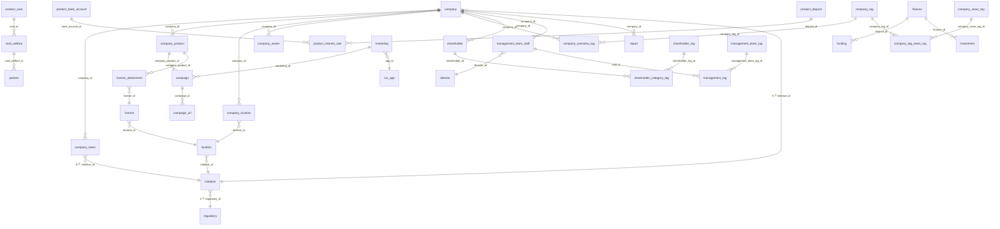

# Neobanker 数据库 Schema 报告

> 生成时间：2026-05-09 · 数据库：`neobanker` (MySQL 8.0.45) · 端口：3307
> 来源：JPA `ddl-auto=update` 自动建表 + `import_data/` 脚本灌入 CSV 数据

---

## 1. 启动方式 (本次实测)

由于 `docker-compose.yml` 拉镜像超时，我用了**容器内置 MySQL** 的替代方案：

```bash
# 1. 在 my-ubuntu-dev 容器内启动自带的 mysql-server-8.0
docker exec my-ubuntu-dev bash -c "
  sed -i 's/^# port.*= 3306/port = 3307/; s/bind-address.*= 127.0.0.1/bind-address = 0.0.0.0/' \
    /etc/mysql/mysql.conf.d/mysqld.cnf
  service mysql start
"

# 2. 创建库与用户（匹配 application.properties）
docker exec my-ubuntu-dev mysql -uroot -e "
  CREATE DATABASE neobanker CHARACTER SET utf8mb4;
  CREATE USER 'neobanker_backend'@'%' IDENTIFIED WITH mysql_native_password BY 'neobanker_backend_password';
  GRANT ALL ON neobanker.* TO 'neobanker_backend'@'%';"

# 3. 启动 Spring Boot —— Hibernate JPA `ddl-auto=update` 自动建表
docker exec my-ubuntu-dev bash -c "cd /workspace/repos/neobanker-backend-MVP-V2 && \
  export JAVA_HOME=/usr/lib/jvm/java-17-openjdk-amd64 && ./mvnw spring-boot:run"

# 4. 数据导入（用脚本 import_data/import_scripts/import_*.py）
docker exec my-ubuntu-dev bash -c "cd /workspace/repos/neobanker-backend-MVP-V2/import_data/import_scripts && \
  python3 import_company.py ../csv_data/company575_已查重.csv && \
  python3 import_news.py ../csv_data/news_2025-03-31.csv && \
  python3 import_company_product.py '../csv_data/product - Sheet1_cleaned.csv' && \
  python3 import_financials.py ../csv_data/500financials+4market.csv && \
  python3 import_management.py ../csv_data/management.csv && \
  python3 import_no_tech.py ../csv_data/employee_noTech.csv && \
  python3 import_shareholder.py ../csv_data/shareholder.csv && \
  python3 import_marketing.py ../csv_data/Marketing_cleaned.csv && \
  python3 import_marketing_subtables.py '../csv_data/Marketing_New_Table - Sheet1.csv'"
```

> ⚠️ `run_import.sh` wrapper 假设 MySQL 跑在 `mysql-db` 容器里（docker-compose 命名）。
> 如果你不用 docker-compose，要么写一个 `docker` shim 脚本（我做的），要么直接调 `import_*.py`。

### 健康检查

```bash
$ curl -sS http://127.0.0.1:8080/actuator/health
{"status":"DOWN","components":{
  "db":{"status":"UP","details":{"database":"MySQL"}},
  "redis":{"status":"UP","details":{"version":"7.4.0"}},
  "elasticsearch":{"status":"DOWN"},   # ⚠️ 没启动 ES，搜索功能不可用
  "diskSpace":{"status":"UP"},
  "ping":{"status":"UP"}
}}
```

---

## 2. 数据导入摘要

| 表 | 行数 | CSV 来源 |
|---|---:|---|
| `company` | **555** | `company575_已查重.csv` |
| `company_news` | **27,550** | `news_2025-03-31.csv` |
| `company_product` | **2,702** | `product - Sheet1_cleaned.csv` |
| `staff_management` | **2,740** | `management.csv` |
| `staff_shareholder` | **2,193** | `shareholder.csv` |
| `marketing_social_media_detail` | **921** | `Marketing_New_Table - Sheet1.csv` |
| `financials` | **604** | `500financials+4market.csv` |
| `staff_employee_no_and_tech` | **577** | `employee_noTech.csv` |
| `marketing_base_header` | **200** | `Marketing_New_Table - Sheet1.csv` |
| `marketing` | **154** | `Marketing_cleaned.csv` |
| `marketing_app_latest_record` | **122** | `Marketing_New_Table - Sheet1.csv` |
| `web3` | 0 | （无 CSV） |
| **合计** | **38,318** | |

> 🔢 共 65 个表，55 个外键约束。空表是 JPA 建好但还没灌数据（业务流程触发或后续批次）。

---

## 3. 高层架构图（按业务域分组）

```mermaid
flowchart TB
    subgraph CORE["🏦 核心域 — Company"]
        company["company<br/>555 rows"]
        company_news["company_news<br/>27.5K rows"]
        financials["financials<br/>604 rows"]
        report["report"]
    end

    subgraph PRODUCT["💳 产品域"]
        company_product["company_product<br/>2.7K rows"]
        product_card["product_card"]
        product_deposit["product_deposit"]
        product_lending["product_lending"]
        product_bank_account["product_bank_account"]
        product_interest_rate["product_interest_rate"]
        product_transfer_and_exchange["product_transfer_and_exchange"]
        card_welfare["card_welfare"]
        license_obtainment["license_obtainment"]
    end

    subgraph MARKETING["📣 营销域"]
        marketing["marketing<br/>154 rows"]
        marketing_base_header["marketing_base_header<br/>200 rows"]
        marketing_app_latest_record["marketing_app_latest_record<br/>122 rows"]
        marketing_social_media_detail["marketing_social_media_detail<br/>921 rows"]
        campaign["campaign"]
        campaign_url["campaign_url"]
        ios_app["ios_app"]
    end

    subgraph PEOPLE["👥 人员域"]
        staff_management["staff_management<br/>2.7K rows"]
        staff_shareholder["staff_shareholder<br/>2.2K rows"]
        staff_employee_no_and_tech["staff_employee_no_and_tech<br/>577 rows"]
        management_team_staff["management_team_staff"]
        management_team_tag["management_team_tag"]
        management_tag["management_tag"]
        director["director"]
        shareholder["shareholder"]
        shareholder_tag["shareholder_tag"]
        shareholder_category_tag["shareholder_category_tag"]
    end

    subgraph REGULATORY["⚖️ 监管 / Initiative 域"]
        initiative["initiative"]
        regulatory["regulatory"]
        license["license"]
    end

    subgraph LOCATION["🌍 位置 / 通用"]
        location["location"]
        company_location["company_location"]
        company_owner["company_owner"]
        company_tag["company_tag"]
        company_overview_tag["company_overview_tag"]
        company_news_tag["company_news_tag"]
        company_tag_news_tag["company_tag_news_tag"]
        company_search["company_search"]
    end

    subgraph FINANCE["💰 资金 / 投资"]
        finance["finance"]
        financial_data["financial_data"]
        funding["funding"]
        ffunding["ffunding"]
        investment["investment"]
        finvestment["finvestment"]
        investor_info["investor_info"]
    end

    subgraph USER["👤 用户互动"]
        user_bank_interest["user_bank_interest"]
        user_invitation["user_invitation"]
        user_message["user_message"]
        user_product_subscription["user_product_subscription"]
        user_registration_event["user_registration_event"]
        invitations["invitations"]
        profile["profile"]
        contact_us["contact_us"]
    end

    subgraph MISC["🔧 其他"]
        web3["web3"]
        bank["bank"]
        account["account"]
        partner["partner"]
        our_partner["our_partner"]
        our_team["our_team"]
        resource_url["resource_url"]
        search_logs["search_logs"]
    end

    company --> initiative
    company --> company_product
    company --> company_news
    company --> financials
    company --> shareholder
    company --> management_team_staff
    company --> company_location --> location
    company_product --> campaign
    campaign --> marketing
    marketing --> ios_app
    initiative --> regulatory
    location --> license
    finance --> funding
    finance --> investment
```



---

## 4. 核心 ER 图（仅含外键关系最密集的表）



---

## 5. 全部 65 张表（按域分组）

### 5.1 核心域（10 张）
`company`, `company_location`, `company_news`, `company_news_tag`, `company_overview_tag`, `company_owner`, `company_search`, `company_tag`, `company_tag_news_tag`, `report`

### 5.2 产品域（9 张）
`company_product`, `product_bank_account`, `product_card`, `product_deposit`, `product_interest_rate`, `product_lending`, `product_transfer_and_exchange`, `card_welfare`, `license_obtainment`

### 5.3 营销域（7 张）
`marketing`, `marketing_app_latest_record`, `marketing_base_header`, `marketing_media_info`, `marketing_social_media_detail`, `campaign`, `campaign_url`, `ios_app`

### 5.4 人员域（10 张）
`staff_management`, `staff_shareholder`, `staff_employee_no_and_tech`, `management_team_staff`, `management_team_tag`, `management_tag`, `director`, `shareholder`, `shareholder_tag`, `shareholder_category_tag`

### 5.5 监管/Initiative（3 张）
`initiative`, `regulatory`, `license`

### 5.6 位置/通用（4 张）
`location`, `bank`, `account`, `web3`

### 5.7 资金/投资（7 张）
`finance`, `financial_data`, `financials`, `funding`, `ffunding`, `investment`, `finvestment`, `investor_info`

### 5.8 用户互动（8 张）
`user_bank_interest`, `user_invitation`, `user_message`, `user_product_subscription`, `user_registration_event`, `invitations`, `profile`, `contact_us`

### 5.9 杂项（4 张）
`partner`, `our_partner`, `our_team`, `resource_url`, `search_logs`

---

## 6. 完整外键清单（55 条）

| 子表 | 子列 | → | 父表 | 父列 |
|---|---|---|---|---|
| campaign | company_product_id | → | company_product | id |
| campaign | marketing_id | → | marketing | id |
| campaign_url | campaign_id | → | campaign | id |
| card_welfare | card_id | → | product_card | id |
| company | cbdc_implementation_company_id | → | initiative | id |
| company | cbdc_proposal_company_id | → | initiative | id |
| company | cross_border_cbdc_cooperation_company_id | → | initiative | id |
| company | cross_border_regulatory_sandbox_company_id | → | initiative | id |
| company | digital_bank_company_id | → | initiative | id |
| company | digital_insurance_company_id | → | initiative | id |
| company | open_api_measures_company_id | → | initiative | id |
| company | regulatory_sandbox_company_id | → | initiative | id |
| company_location | company_id | → | company | id |
| company_location | location_id | → | location | id |
| company_news | company_id | → | company | id |
| company_news | (×8) initiative refs | → | initiative | id |
| company_overview_tag | company_id | → | company | id |
| company_overview_tag | company_tag_id | → | company_tag | id |
| company_owner | company_id | → | company | id |
| company_product | company_id | → | company | id |
| company_tag_news_tag | company_news_tag_id | → | company_news_tag | id |
| company_tag_news_tag | company_tag_id | → | company_tag | id |
| funding | finance_id | → | finance | id |
| initiative | (×8) regulatory refs | → | regulatory | id |
| investment | finance_id | → | finance | id |
| license | location_id | → | location | id |
| license_obtainment | company_product_id | → | company_product | id |
| license_obtainment | license_id | → | license | id |
| location | initiative_id | → | initiative | id |
| management_tag | management_team_tag_id | → | management_team_tag | id |
| management_tag | staff_id | → | management_team_staff | id |
| management_team_staff | company_id | → | company | id |
| management_team_staff | director_id | → | director | id |
| marketing | app_id | → | ios_app | app_id |
| partner | card_welfare_id | → | card_welfare | id |
| product_interest_rate | bank_account_id | → | product_bank_account | id |
| product_interest_rate | deposit_id | → | product_deposit | id |
| report | company_id | → | company | id |
| shareholder | company_id | → | company | id |
| shareholder_category_tag | shareholder_id | → | shareholder | id |
| shareholder_category_tag | shareholder_tag_id | → | shareholder_tag | id |

---

## 7. 已知问题 & 后续动作

| # | 问题 | 影响 | 修复建议 |
|---|---|---|---|
| 1 | `Elasticsearch` 没起 → `/homepage/esSearch` 返回 500 | banks-statistics 列表为空 | `docker run -d -p 9200:9200 -e discovery.type=single-node elasticsearch:7.10.0` |
| 2 | `bank-info/[sortId]/overview/page.tsx:220` 没做 `AboutData.owners` null 检查 | sortId=1 (ZA Bank) 详情页 crash | 加 `?.owners?.[0]` optional chaining |
| 3 | web3 没 CSV 文件 | `web3` 表空 | 找产品要 `web3.0.csv` 或者从 web3 子文件抽 |
| 4 | `marketing_subtables` 部分行 `google_play_link` 列太短 (`Data too long`) | 122/200/921 已入，剩余被 truncate | `ALTER TABLE marketing_app_latest_record MODIFY google_play_link TEXT;` |
| 5 | `run_import.sh` hardcode `docker exec mysql-db ...` | 不用 docker-compose 时报错 | 重构为 `MYSQL_PWD=... mysql -h $DB_HOST -P $DB_PORT` |
| 6 | DNS：容器 `/etc/resolv.conf` 用 `192.168.71.185`，解析超时 | 容器拉 maven、apt 包失败 | 我已临时改为 8.8.8.8（重启容器后会还原），永久修复要改 docker daemon `--dns=8.8.8.8` |

---

## 8. 验证截图

- 主页新闻：真实 `company_news` 数据（27,550 条），如 "Titan Trust Bank Selects Oracle FSS"、"Bank of America Still Fair Price But..."
- API 直查 `POST /homepage/getBanksStatistics`：返回 Bnext / OakNorth Bank 等真实银行
- `SHOW TABLES` 在 `neobanker` 库下 65 张表全部存在，FK 约束 55 条正常生成
